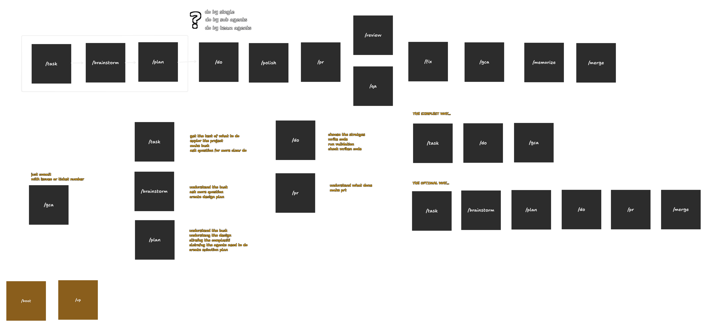

# sp



Маркетплейс скиллов и команд для Claude Code, вдохновлённый [obra/superpowers](https://github.com/obra/superpowers).

## Структура

```
sp/
├── .claude-plugin/
│   ├── plugin.json          # манифест плагина
│   └── marketplace.json     # реестр плагинов маркетплейса
├── skills/                  # скиллы (автообнаружение)
│   └── hello/
│       └── SKILL.md
├── commands/                # slash-команды
│   └── hello.md
├── _skills/                 # черновики (не часть плагина)
└── README.md
```

## Установка

### Из GitHub (рекомендуемый способ)

```bash
claude /install-plugin https://github.com/projectory-com/sp
```

### Вручную

Клонируй репозиторий и укажи путь:

```bash
git clone https://github.com/projectory-com/sp.git
claude /install-plugin /path/to/sp
```

## Использование

После установки доступны:

| Компонент | Тип | Описание |
|-----------|-----|----------|
| `hello` | skill | Приветствие и обзор структуры маркетплейса |
| `/hello` | command | Приветственное сообщение со списком доступных плагинов |

## Планируемые команды

`/task` `/brain` `/plan` `/do` `/polish` `/pr` `/review` `/qa` `/fix` `/memorize` `/merge`

## Разработка

Для добавления нового скилла:

```
skills/<имя-скилла>/SKILL.md
```

Для добавления новой команды:

```
commands/<имя-команды>.md
```

Оба формата используют YAML frontmatter с полями `name` и `description`.

## Лицензия

MIT
